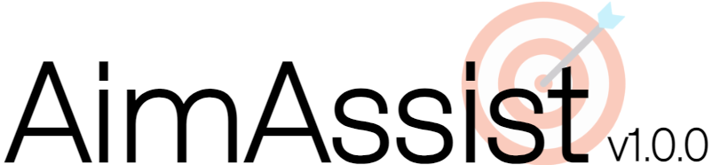

  
    
  The aiming solution for competitive and casual players alike. Runs in the browser, on any device. Completely undetectable.

https://github.com/CtrlAltExecute/AimAssist/assets/157523173/20bef9a4-349f-4b39-9bf9-1b9f6d7acb30

## Features

- 🔦 one-of-a-kind spotlight for advanced player focus and targetting    

- 🔭 gazeline for accurate fire destination prediction    

- ⚙️ customizable keybinds and colors    

## → [get started](https://github.com/CtrlAltExecute/AimAssist/blob/main/tutorial.md) - it takes less than 5 minutes
